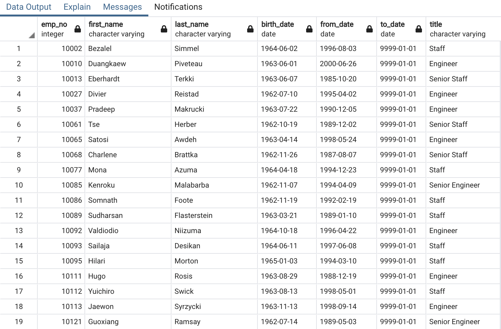

# Pewlett-Hackard-Analysis

## Overview

## Results

- Using the image below we can see the relationship between the data sources as a ERD (Etity Relationship Diagram) for a better indication of what columns of information we want to explore.

### Future Job Openings

- Our analysis found around 64% (57,668/90,398 = 64%) of senior titles are held by employees of retirement age.

- The image bleow is a list of candidates that qualify to become members of the mentorship program.

## Summary

- With 64% of their employees eligible for retirement, and others being redirected to their mentorship initiatives, an extensive hiring process in the upcoming years will be required to offsef the loss of both senior level and working staff. Since a significant amount of future retirees hold Senior positions the mentorship program should emphasize gathering as much knowledge from retiring senior staff, to prevent a loss of thier expertise that will be leaving the company in the years to come. 

## Resources

Data Sources: departments.csv, dept_emp.csv, dept_manager.csv, employees.csv, salaries.csv, titles.csv

Software: SQL, PostgreSQL, pgAdmin
