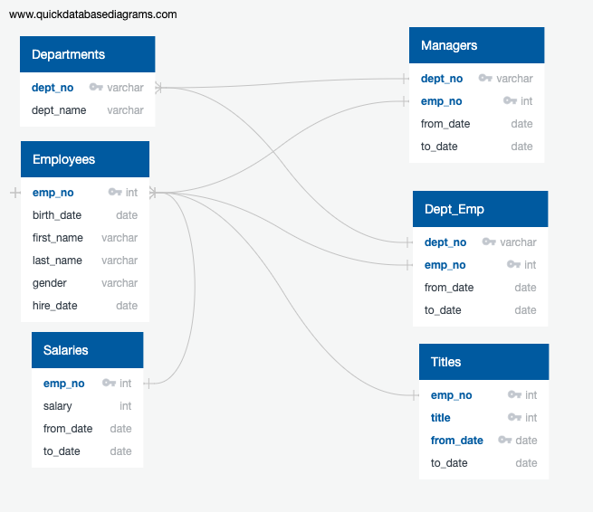

# Pewlett-Hackard-Analysis

## Overview

Goals list for this analysis:

  1. Identify the retiring employees by their title.
  2. Determine the sum of retiring employees grouped by title.
  3. Identify the employees eligible for participation in the mentorship program.
  4. Determine the number of roles-to-fill grouped by title and department.
  5. Determine the number of qualified, retirement-ready employees to mentor the next generation grouped by title and department.

## Results

- Using the image below we can see the relationship between the data sources as a ERD (Etity Relationship Diagram) for a better indication of what columns of information we want to explore.

### Future Job Openings

- Our analysis found around 64% (57,668/90,398 = 64%) of senior titles are held by employees of retirement age.

- The image bleow is a list of candidates that qualify to become members of the mentorship program.

## Summary

- With 64% of their employees eligible for retirement, and others being redirected to their mentorship initiatives, an extensive hiring process in the upcoming years will be required to offsef the loss of both senior level and working staff. Since a significant amount of future retirees hold Senior positions the mentorship program should emphasize gathering as much knowledge from retiring senior staff, to prevent a loss of thier expertise that will be leaving the company in the years to come. 
- Since there are only 1,940 employees who are able to mentor and train new hires, if all employees eligible for retirement were to leave the company, the training staff would be overwhelmed.

- To prepare for this impending "Silver Tsunami" we can write the following code to generate two additional tables.

- The two tables give us the Sum of retirement-ready employees group by title and department.

- As well as the Sum of qualified, retirement-ready employees group by title and department

- This will help us find the best suited staff to move up the ranks of the company.

## Resources

Data Sources: departments.csv, dept_emp.csv, dept_manager.csv, employees.csv, salaries.csv, titles.csv

Software: SQL, PostgreSQL, pgAdmin
